# Book Notes

Book Notes es una sencilla aplicación web para tomar notas de libros, creada con React, TypeScript y TailwindCSS. Su editor de bloques, inspirado en Jupyter Notebook, te permite organizar tus ideas de forma intuitiva. Para el manejo de datos, la aplicación utiliza el almacenamiento local de tu navegador (local storage), todo bajo un enfoque minimalista y fácil de usar.

# Guía de uso

La siguiente guía detalla el funcionamiento básico de la aplicación a nivel de usuario.

## Primera apertura

La primera vez que abras el programa, te encontrarás con una pantalla de bienvenida que indica que aún no has creado ninguna nota.

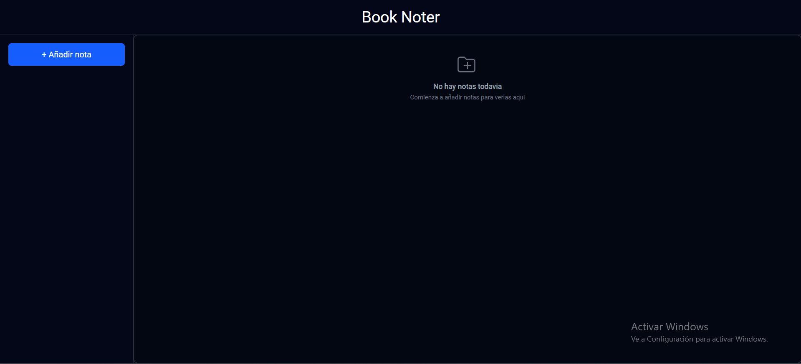

Para crear tu primera nota, haz clic en el botón **"+ Añadir Nota"**, ubicado en la barra lateral izquierda.

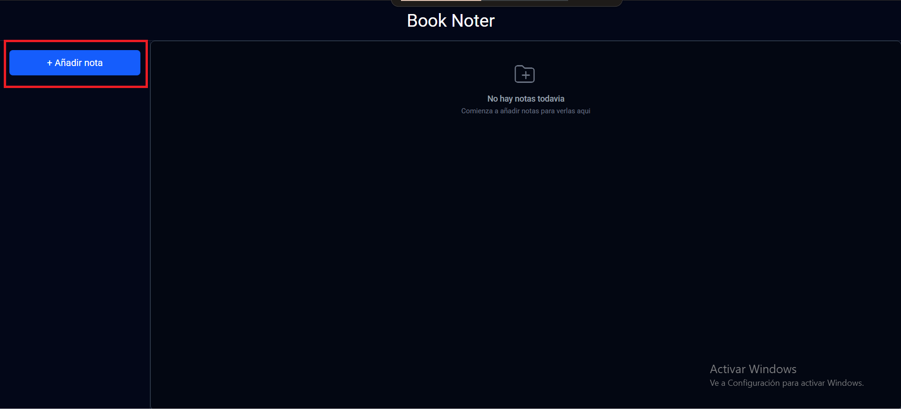

A continuación, ingresa los detalles del libro, incluyendo una imagen de portada.

**Advertencia:** En la versión actual, todos los datos se guardan en el almacenamiento local del navegador. Si borras los datos de navegación de tu navegador, tus notas se eliminarán permanentemente. Esta limitación se corregirá en una futura versión con Electron.

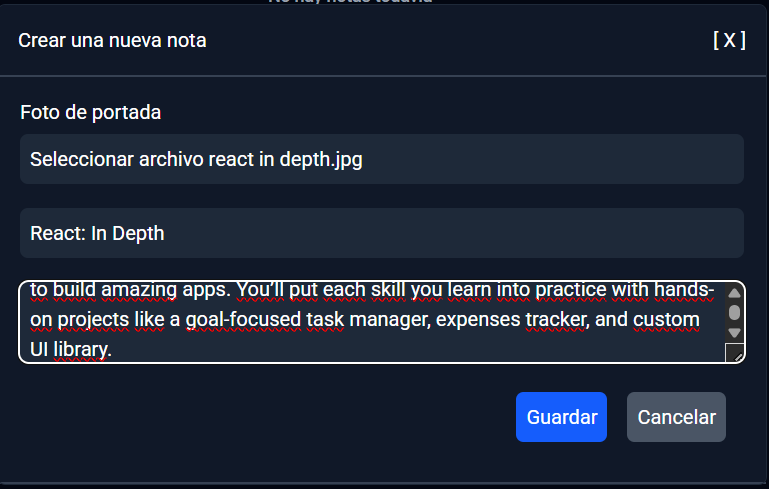

Una vez que presiones **"Guardar"**, se abrirá automáticamente el editor de texto con la nota recién creada, lista para que comiences a añadir tus anotaciones.

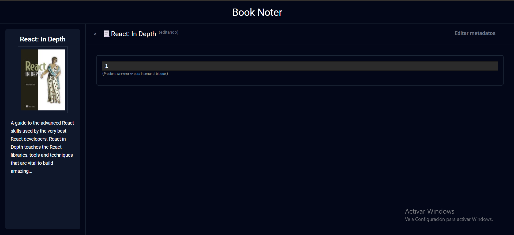

El editor es compatible con el lenguaje **Markdown** y soporta todas sus directivas estándar. Para aprender más sobre este lenguaje, puedes visitar la siguiente guía de inicio: [Markdown Guide - Getting Started](https://www.markdownguide.org/getting-started/).

Si deseas profundizar en la sintaxis, consulta esta página: [Markdown Guide - Basic Syntax](https://www.markdownguide.org/basic-syntax/).

## Elementos del editor

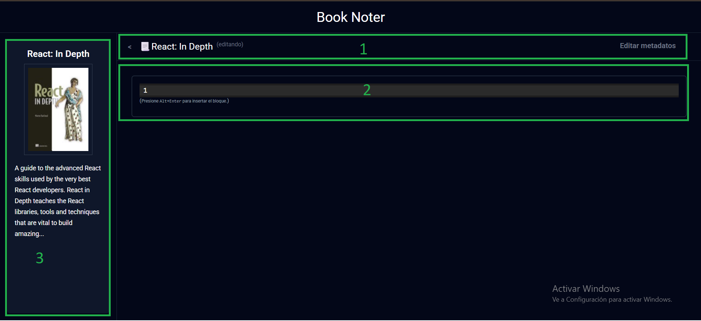

El editor se divide en tres componentes principales, que se detallan a continuación.

### 1. Encabezado

El encabezado consta de tres elementos funcionales:

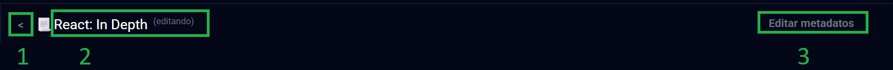

1.  **Botón de volver:** Te regresa a la página anterior donde se listan todas tus notas.
2.  **Título:** Muestra el título de la nota que estás editando.
3.  **Botón de metadatos:** Despliega un menú para añadir o editar los metadatos del libro.

#### Tabla de metadatos

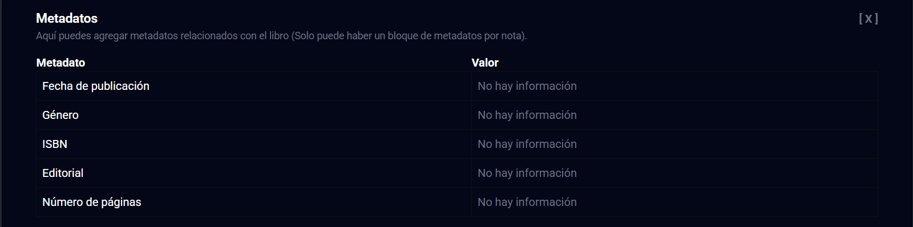

La tabla de metadatos es editable. Para añadir o modificar un valor, simplemente haz clic en el texto correspondiente (por ejemplo, "no hay información"). Se desplegará un campo de texto para que puedas ingresar el nuevo valor.

### 2. Editor

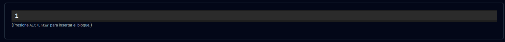

El editor principal es un campo de texto donde puedes escribir contenido utilizando la sintaxis de Markdown. Cuando termines de escribir un bloque, presiona `Alt+Enter` para añadirlo a la nota. Puedes agregar tantos bloques como desees, organizando tus ideas de manera modular.

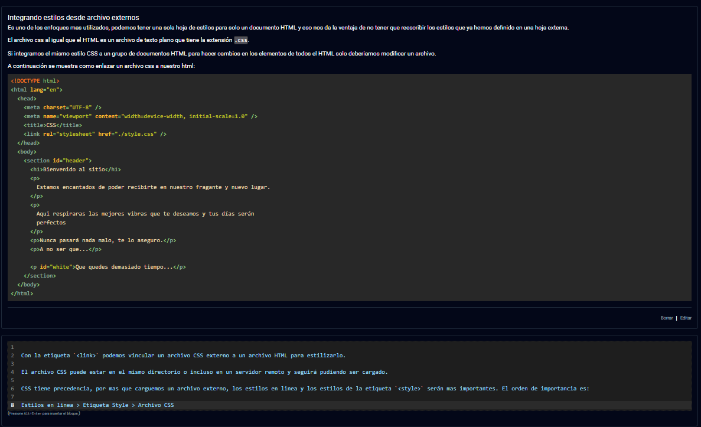

Al pasar el cursor sobre un bloque ya creado, aparecerán dos botones en la esquina inferior derecha:

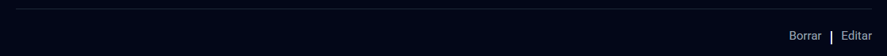

- **Editar:** Convierte el bloque en un campo de texto editable. Para guardar los cambios, presiona nuevamente `Alt+Enter`.
- **Borrar:** Elimina el bloque de forma permanente.

### 3. Barra lateral

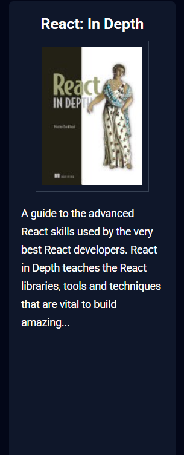

La barra lateral muestra un resumen de los detalles de la nota que ingresaste al crearla, como el título, autor y la imagen de portada.

## Opciones adicionales

Si necesitas corregir algún detalle de un libro (como un error en el título o el autor), puedes hacer clic derecho sobre la nota en la lista principal. Se abrirá un menú contextual con tres opciones:

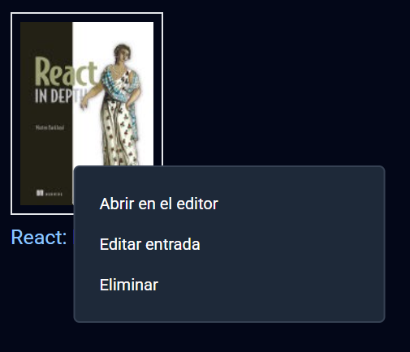

- **Abrir en el editor:** Abre la nota seleccionada para ver o añadir contenido.
- **Editar:** Permite modificar los detalles iniciales de la nota (título, autor, portada, etc.).
- **Eliminar:** Borra la nota y todo su contenido de forma definitiva.

## Abrir una nota

Para abrir una nota existente, simplemente haz clic izquierdo sobre ella en la pantalla principal. Se cargará el editor con todo el contenido de la nota seleccionada.

## ¡Gracias por usar la aplicación!

Agradezco sinceramente que utilices esta herramienta. Como ávido lector, la he desarrollado para mi uso personal y espero que a ti también te resulte de gran utilidad para organizar las notas de tus libros.
